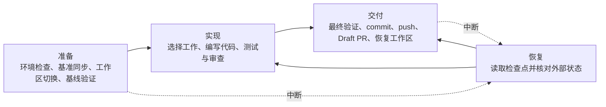

# AutoProgress

AutoProgress 是一个面向 Unity C# 项目的 Codex 插件。它把“寻找改进项”和“实现改进项”组织成受控任务，为定时实现保留每日额度，同时允许人工不限次数发起任务，并始终保留人工审查与合并权。

核心原则是“代码守门，模型推理”：可形式化的配置与环境校验、版本控制状态转换、重试、恢复和交付事实由可测试脚本处理；模型负责理解意图、设计和编写代码、审查改动，以及解释需要用户处理的问题。成功且无需人工行动的内部阶段保持静默。

## 主要能力

- `$maintain-project`：执行一次实现维护批次、人工提前运行或未完成任务恢复。
- `$discover-improvements`：审查代码并通过 Draft PR 提交候选改进项，不修改产品代码。
- `$configure-auto-progress`：初始化、迁移、验证、暂停、恢复、查看或导出状态。
- `$queue-directed-improvement`：录入少量人工指定的改进项，不自动执行。
- `$record-improvement-rejection`：根据人工提供的 `IMP-ID` 和拒绝理由，创建或完善拒绝记录 Draft PR。
- 使用确定性检查点恢复中断的任务，并核对本地提交、远端分支和 PR 状态。
- 由代码直接生成运行记录和最终 PR 报告，事实字段不依赖模型拼接。

除定时 `$maintain-project` 外，其余入口只能由使用者显式调用。人工调用 `$maintain-project` 不占每日额度；只有定时触发的实现任务占用额度。

## 环境要求

- 支持本地 marketplace 和插件的 Codex 环境。
- Python 3.11 或更高版本。
- Git，以及已完成身份和远端配置的受管仓库。
- GitHub CLI（`gh`），并已登录可访问目标仓库的账号。
- Unity C# 项目，以及可由命令行执行的真实构建验证步骤。
- Unity MCP 为可选能力，不是普通工作区准入的必要条件。

## 安装

1. 克隆本仓库。
2. 将仓库内的本地 marketplace 加入 Codex：

```powershell
codex plugin marketplace add "<path-to-auto-progress>/.agents/plugins"
```

3. 安装插件：

```powershell
codex plugin add auto-progress@auto-progress-local
```

4. 新建一个 Codex 任务，使新安装的 skill 生效。

更新本地克隆后，再次执行第 3 步即可刷新插件缓存版本。

## 快速开始

在需要管理的 Unity 仓库中显式调用：

```text
使用 $configure-auto-progress init 初始化当前 Unity 项目。
```

项目策略保存在：

```text
.codex/auto-progress.toml
```

初始化后至少需要人工确认：

- `project.base_branch`：PR 唯一允许使用的目标分支。
- `project.timezone`：例如 `Asia/Shanghai`。
- `validation.steps`：项目真实可用的 C# 构建命令。
- `paths.allowed` 和 `paths.excluded`：自动修改范围。
- Unity MCP 模式、端点和期望的项目根目录。

模板中的 `YourUnityProject.sln` 只是示例，必须替换成真实项目入口。配置确认完成后，可以先寻找改进项：

```text
使用 $discover-improvements 为当前项目补充改进池。
```

也可以直接提前执行当天的实现任务：

```text
使用 $maintain-project 提前执行今天的 AutoProgress 实现任务。
```

## 使用方式

### 寻找改进项

发现任务会从最新远端基准分支创建轻量 worktree。它不复制 Unity `Library`，不调用 Unity MCP，也不执行 C# 构建。候选项只通过 Draft PR 提交；人工合入基准分支后，它们才会进入权威改进池。

默认限制包括：

- 目标库存中 10 项普通自动 `queued` 改进。
- 单次最多提出 10 项。
- 初始审查 30 个 C# 文件，每轮最多扩展 15 个。
- 单次最多审查 60 个文件、合计 12,000 行源码。
- 总时长受 `project.max_run_minutes` 限制，默认 60 分钟。

发现任务是人工入口，不占用定时实现的每日额度。它复用仓库外的常驻轻量 worktree，任务结束后以 detached HEAD 停放，不反复创建和删除目录。

### 实现维护批次

工作选择顺序为：

1. 恢复已有实现分支，或处理实现 PR 的审查反馈。
2. 修复远端基准分支已有的 C# 编译错误。
3. 执行最高优先级的人工指令改进项。
4. 从权威改进池选择最多 3 个兼容的普通自动改进项。
5. 没有合格工作时安全跳过。

恢复、编译修复和人工指令项默认独占一次运行。普通改进项只有在模块、范围、验证路径和总预算兼容时才能组成批次。每项改进保留独立 ID、验收条件和 commit。

### 人工指令改进项

```text
使用 $queue-directed-improvement 创建人工指令改进项：
<描述期望结果、验收条件、允许范围与必要豁免>。
```

人工指令项可豁免拒绝清单，但仍受 Git 安全、冲突人工处理、验证真实性和人工合并等硬规则约束。除拒绝清单外，只有明确写入该指令项的豁免才生效。

### 暂停、恢复与状态

```text
使用 $configure-auto-progress pause 暂停每日自动任务。
使用 $configure-auto-progress resume 恢复每日自动任务。
使用 $configure-auto-progress status 查看当前状态。
```

暂停不会中断已经开始的任务；当天尚未开始时，则取消当天任务。恢复后不会自动补偿错过的维护日。

改进项文件名使用 `IMP-...--queued.md`、`IMP-...--implemented.md` 或 `IMP-...--cancelled.md`。`implemented` 表示 AutoProgress 已成功交付 Draft 实现 PR，不表示已经由人工合并。

### 仓库规范与拒绝策略

配置可逐项声明代码实现需要遵守的仓库规范文档，默认位置为根目录 `AGENTS.md`、`CLAUDE.md` 和 `.github/copilot-instructions.md`。AutoProgress 为每份文档单独保存 Git blob SHA 和仓库外缓存；只有某份文档发生变化时才重新读取该文档。

具体改进项的拒绝记录保存在 `docs/auto-progress/rejections/<IMP-ID>.md`。调用方式：

```text
使用 $record-improvement-rejection 拒绝 IMP-2026.08.01-xxxxxxxx，理由是：<人工提供的理由>。
```

如果还没有对应改进项，可直接在 `docs/auto-progress/rejection-rules.md` 中添加 `REJ-<kebab-case>` 规则，描述不希望 AutoProgress 提出的方案模式、理由和范围。两类拒绝都会阻止实质相似的自动候选项；人工指令改进项仍按其显式豁免规则处理。

## 配置

### Unity MCP

实现任务复用原始 Unity 项目目录和现有 `Library`。配置 Unity MCP 后，AutoProgress 可以连接匹配项目根目录的 Unity Editor，在 checkout 后刷新并检查 C# 编译结果。

```toml
[unity_mcp]
mode = "optional" # disabled | optional | required
adapter = "coplaydev-unity-mcp"
transport = "streamable_http"
url = "http://127.0.0.1:8080/mcp"
expected_project_root = "."
connect_timeout_seconds = 5
operation_timeout_minutes = 10
```

仅允许 `127.0.0.1`、`localhost` 或 `::1` 端点，不允许 `0.0.0.0`、局域网或公网地址，也不在项目配置中保存认证信息。`adapter` 指定受信任的 Unity MCP 工具契约；脚本通过 initialize 和 `tools/list` 验证服务能力。

`optional` 模式下，即使 Editor 已打开但 MCP 不存在或连接失败，也会退回结构化 C# 验证并保持 Draft，不影响普通工作区准入。此时无法确认未保存的 Scene/Asset 以及 Play、Build、Import、Compile 或 Refresh 状态，这些项目会在运行记录和 PR 中标为未验证。

只有实际完成匹配 Editor 的刷新且 C# 编译通过时，PR 才能自动标记 Ready；否则必须保持 Draft 并显示：

```text
未经 Unity 编译测试
```

### 版本与迁移

当前发布版本是 `0.3.0+codex.20260801090948`。后续发布统一使用 SemVer 2.0 格式 `MAJOR.MINOR.PATCH+codex.YYYYMMDDHHMMSS`，其中 14 位 UTC 时间仅作为 Codex 本地插件缓存标识，不参与 SemVer 版本优先级比较。破坏兼容性的变更提升 MAJOR，向后兼容的新能力或需要兼容迁移的新配置提升 MINOR，兼容修复提升 PATCH。

插件发布版本和项目内 `schema_version` 相互独立。升级到 0.3.0 后，旧项目配置必须由人工显式调用：

```text
使用 $configure-auto-progress migrate 迁移当前项目配置。
```

迁移按版本逐段执行。v2 先迁移到 v3；v3 到 v4 的确定性预览命令是：

```powershell
python <plugin-root>/scripts/auto_progress.py migrate-config-v4 --config .codex/auto-progress.toml --repo .
```

确认完整差异后，使用同一命令加 `--write` 写入，再运行 `validate-config`。v4 会新增预防性拒绝规则路径，并分别记录 `AGENTS.md`、`CLAUDE.md` 和 `.github/copilot-instructions.md` 当前提交的 Git blob SHA；缺失文档记录空值，之后运行会在文档出现或变化时自行刷新。

旧的无状态后缀 `IMP-ID.md` 不要求批量改名：它仍按 frontmatter 兼容读取，新建改进项使用 `--queued`，成功交付实现 PR 时才随该次状态提交迁移为 `--implemented`。迁移只修改用户确认的配置或正常交付触及的改进项，不会自动 commit、创建迁移 PR 或频繁重命名其余文件。

## 工作原理

一次运行由确定性准备、模型实现、确定性交付和故障恢复组成：



- 准备阶段检查配置和环境，从远端基准创建实现分支或复用常驻发现 worktree，并执行适用的基线验证。失败时恢复本阶段产生的可逆变化。
- 实现阶段由模型理解意图、组合改进项、编写代码和测试，并审查 diff。
- 交付阶段重新检查实际 diff、修改范围、预算和 Git identity，完成最终验证、commit、push、Draft PR 和工作区恢复。
- 每个已完成阶段都保存检查点。中断后从最后一个可靠检查点继续；外部状态不明确时请求人工处理。

确定性脚本在中途失败时恢复该脚本执行前的状态；已经成功完成并形成检查点的前序脚本结果不会丢失。运行中间状态按项目 ID 和运行 ID 保存在 Codex 本地状态根目录，不写入受管项目工作树或 `.git`。

最终验证后，系统保存覆盖模型改动的内容指纹。生成运行记录后，如果 commit 前代码内容发生变化，必须重新验证。指纹只覆盖与交付相关的文件，不扫描 Unity `Library` 等大型生成目录。

模型提供改进项 ID、逐项摘要、验收说明和设计取舍；代码计算实际路径、diff、预算、Git identity、验证结果、提交版本、远端和 PR 状态。最终 PR 标题、正文和仓库内运行记录均由代码根据受信任模板和实际事实直接生成。

## 安全边界

- 基准分支由人工配置，也是唯一允许的 PR 目标分支。
- 所有 PR 默认创建为 Draft，永不自动合并。
- Git 冲突只能由人工解决；自动任务不执行 merge、rebase、force-push、stash、reset 或 clean。
- 每个维护日最多占用一次定时实现额度；人工任务不限次数，但仍受工作区、未完成运行和现有 PR 等门禁约束。
- 没有安全且有价值的工作时允许跳过，不创建空 commit。
- Unity 未实际刷新与编译验证时，PR 必须明确标注“未经 Unity 编译测试”。
- 本地运行账本按月追加保存，默认永久保留，只能由人工确认清理。

## 部署限制

当前只支持一个受管项目文件路径对应一个 AutoProgress 配置和一个运行来源。系统不提供跨实例锁，也不协调以下部署：

- 同一项目的多个 clone 同时配置 AutoProgress。
- 同一路径存在多个 AutoProgress 配置、automation 或运行实例。
- 多个受管项目配置共享同一个 Unity 工作目录。

使用者必须自行保证这些情况不会发生，并在 AutoProgress 运行期间遵守原项目目录租约。检查点用于崩溃恢复，不构成并发锁，也不能保护不受支持的多实例部署。

## 开发与验证

运行脚本测试：

```powershell
python -m unittest discover -s plugins/auto-progress/scripts -p "test_*.py" -v
```

校验示例配置：

```powershell
python plugins/auto-progress/scripts/auto_progress.py validate-config `
  --config plugins/auto-progress/assets/auto-progress.toml
```

## 深入阅读

- [完整运行策略](docs/auto-progress/operating-policy.md)
- [领域术语与项目上下文](CONTEXT.md)
- [架构决策记录](docs/adr/)
